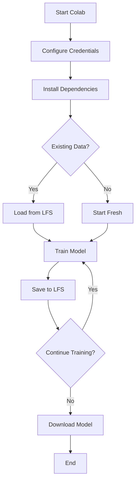

# 🗂️ GitHub LFS Workflow Guide for Amharic XTTS

## Overview

This guide explains how to use **GitHub LFS (Large File Storage)** to persist your training data, preventing loss when using Google Colab or other temporary environments.

### Why GitHub LFS?

- ✅ **Prevents Data Loss**: Save training checkpoints to GitHub
- ✅ **Resume Anytime**: Continue training from where you left off
- ✅ **Version Control**: Track different model versions
- ✅ **Collaboration**: Share models with team members
- ✅ **Free Tier**: 1GB storage + 1GB bandwidth/month

---

## 📋 Table of Contents

1. [Initial Setup](#initial-setup)
2. [Using Google Colab](#using-google-colab)
3. [Local Development](#local-development)
4. [Helper Scripts](#helper-scripts)
5. [Best Practices](#best-practices)
6. [Troubleshooting](#troubleshooting)

---

## Initial Setup

### 1. Configure Git LFS (Already Done!)

The repository is already configured with Git LFS tracking for:
- `*.pth` - PyTorch model files
- `*.ckpt` - Checkpoint files
- `*.safetensors` - SafeTensors format
- `*.bin` - Binary files
- `*.wav` - Audio files
- `*.zip` - Compressed archives
- `finetune_models/**` - All training outputs

### 2. Create GitHub Personal Access Token

1. Go to https://github.com/settings/tokens
2. Click **"Generate new token (classic)"**
3. Give it a name like `XTTS Training`
4. Select scopes:
   - ✅ `repo` (Full control of private repositories)
5. Click **"Generate token"**
6. **IMPORTANT**: Copy the token immediately (you won't see it again!)

---

## Using Google Colab

### Quick Start

1. **Open the Colab Notebook**:
   - File: `colab_amharic_xtts_with_lfs.ipynb`
   - Or use direct link: [Open in Colab](https://colab.research.google.com/github/Diakonrobel/Amharic_XTTS-V2_TTS/blob/main/colab_amharic_xtts_with_lfs.ipynb)

2. **Run cells in order**:
   ```
   Step 1: Configure GitHub credentials ← Enter your token here
   Step 2: Install dependencies
   Step 3: Clone repository & load existing data
   Step 4: Load helper functions
   Step 5: Launch Gradio WebUI ← Train here
   Step 6: Save progress ← IMPORTANT: Run this frequently!
   ```

### Workflow in Colab



### Saving Training Progress

Run the "Save to GitHub LFS" cell **periodically** during training:

```python
# This cell will:
# 1. Show current training data size
# 2. Commit changes to git
# 3. Push to GitHub LFS
save_training_to_lfs("Epoch 3 completed")
```

**When to save:**
- After each training epoch
- Before taking a break
- When Colab shows disconnection warning
- After completing training

### Resuming Training

If Colab disconnects:

1. Restart the notebook
2. Run Steps 1-3 again
3. Run Step 7 (Resume Training)
4. Continue from Step 5 (Launch WebUI)

---

## Local Development

### Save Training Data

#### Using Helper Script (Linux/Mac):
```bash
# Save with default message
./scripts/save_to_lfs.sh

# Save with custom message
./scripts/save_to_lfs.sh "Completed 10 epochs of Amharic training"
```

#### Using Git Directly:
```bash
# Add all changes
git add .

# Commit with message
git commit -m "Training checkpoint - Epoch 5"

# Push to GitHub (includes LFS)
git push origin main
```

### Load Training Data

#### Using Helper Script:
```bash
./scripts/load_from_lfs.sh
```

#### Using Git Directly:
```bash
# Pull latest changes
git pull origin main

# Pull LFS files
git lfs pull
```

---

## Helper Scripts

### `scripts/save_to_lfs.sh`

Automates saving training data to GitHub LFS.

**Features:**
- Shows current training data size
- Creates timestamped commits
- Pushes to GitHub with LFS
- Displays success message with repo URL

**Usage:**
```bash
./scripts/save_to_lfs.sh                    # Auto timestamp
./scripts/save_to_lfs.sh "Custom message"   # Custom message
```

### `scripts/load_from_lfs.sh`

Loads latest training data from GitHub LFS.

**Features:**
- Pulls latest git changes
- Downloads LFS files
- Shows available training data
- Confirms successful load

**Usage:**
```bash
./scripts/load_from_lfs.sh
```

---

## Best Practices

### 1. Save Frequently

```bash
# Good practice: Save after each major milestone
./scripts/save_to_lfs.sh "Epoch 1 completed"
./scripts/save_to_lfs.sh "Epoch 5 completed"
./scripts/save_to_lfs.sh "Final model - 95% accuracy"
```

### 2. Use Descriptive Messages

```bash
# ❌ Bad
git commit -m "update"

# ✅ Good
git commit -m "Amharic model - Epoch 10/20 - Loss: 0.45"
```

### 3. Check File Sizes

```bash
# Before saving, check sizes
du -sh finetune_models/*

# Output example:
# 245M  finetune_models/dataset
# 1.2G  finetune_models/run
# 856M  finetune_models/ready
```

### 4. Stay Within LFS Limits

GitHub Free tier includes:
- **1 GB** storage
- **1 GB** bandwidth per month

**Tips to optimize:**
- Delete unnecessary checkpoints
- Compress older models
- Use `.gitignore` for temporary files

### 5. Add to .gitignore

Create `.gitignore` for files you don't want to track:

```gitignore
# Temporary files
*.pyc
__pycache__/
.DS_Store
*.swp

# Logs
*.log
logs/

# Large temporary datasets (not needed in repo)
temp/
cache/

# IDE files
.vscode/
.idea/
*.code-workspace
```

---

## Troubleshooting

### Problem: "Git LFS quota exceeded"

**Solution:**
```bash
# Check LFS usage
git lfs ls-files --size

# Remove large files from LFS history (carefully!)
git lfs prune

# Or upgrade to GitHub Pro for more storage
```

### Problem: "Authentication failed"

**Solutions:**
1. Regenerate Personal Access Token
2. Make sure `repo` scope is enabled
3. Check token hasn't expired
4. In Colab: Re-run credentials cell

### Problem: "Cannot find trained model after loading"

**Check:**
```bash
# Verify LFS files were pulled
git lfs ls-files

# Force pull LFS files
git lfs pull --all

# Check directory
ls -lh finetune_models/
```

### Problem: "Colab disconnected during save"

**Don't panic!** Your local changes are safe:
1. Reconnect to Colab
2. Run Steps 1-3 to set up environment
3. Check if changes were pushed:
   ```bash
   git log --oneline -5
   ```
4. If not pushed, run save cell again

### Problem: "Merge conflicts"

If multiple people are training:
```bash
# Pull first
git pull origin main

# If conflicts:
git status
# Resolve conflicts manually
git add .
git commit -m "Resolved merge conflict"
git push origin main
```

---

## Advanced Usage

### Track Specific Directories Only

Edit `.gitattributes`:
```bash
# Track only the 'ready' folder (final models)
finetune_models/ready/** filter=lfs diff=lfs merge=lfs -text

# Don't track temporary training files
finetune_models/run/** -filter=lfs
```

### Use Different Branches for Experiments

```bash
# Create experiment branch
git checkout -b experiment-learning-rate-0.001

# Train and save
./scripts/save_to_lfs.sh "Experiment with LR 0.001"

# Push to new branch
git push origin experiment-learning-rate-0.001

# Switch back to main
git checkout main
```

### Automatic Backups

Create a cron job (Linux/Mac):
```bash
# Edit crontab
crontab -e

# Add line to save every hour
0 * * * * cd /path/to/repo && ./scripts/save_to_lfs.sh "Auto backup"
```

---

## File Size Reference

Typical sizes for Amharic XTTS training:

| File/Directory | Typical Size | Description |
|----------------|--------------|-------------|
| Dataset | 100-500 MB | Processed audio + transcripts |
| Model checkpoint (.pth) | 800 MB - 1.5 GB | Full model state |
| Config files (.json) | < 1 MB | Model configuration |
| Vocab files | < 1 MB | Token vocabulary |
| Audio samples (.wav) | 1-10 MB | Reference audio |

**Total per training run:** ~2-3 GB

---

## GitHub LFS Quotas

### Free Tier
- **Storage:** 1 GB
- **Bandwidth:** 1 GB/month
- **Cost:** Free

### GitHub Pro
- **Storage:** 2 GB
- **Bandwidth:** 2 GB/month
- **Cost:** $4/month

### Additional Packs
- **Storage:** $5/month per 50 GB
- **Bandwidth:** $5/month per 50 GB

---

## Quick Command Reference

```bash
# Save training data
./scripts/save_to_lfs.sh "message"

# Load training data
./scripts/load_from_lfs.sh

# Check LFS files
git lfs ls-files

# Check LFS status
git lfs status

# See LFS file sizes
git lfs ls-files --size

# Pull all LFS files
git lfs pull --all

# Remove old LFS files
git lfs prune

# Check repo size
du -sh .git/lfs/objects
```

---

## Support

**Issues?** Open an issue on GitHub:
https://github.com/Diakonrobel/Amharic_XTTS-V2_TTS/issues

**Questions?** Check:
- [GitHub LFS Documentation](https://git-lfs.github.com/)
- [Git LFS Tutorial](https://github.com/git-lfs/git-lfs/wiki/Tutorial)

---

## License

This guide is part of the Amharic XTTS project.
See [LICENSE](LICENSE) for details.

---

**Happy Training! 🇪🇹🚀**
